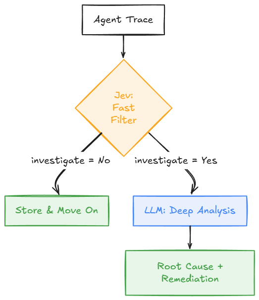
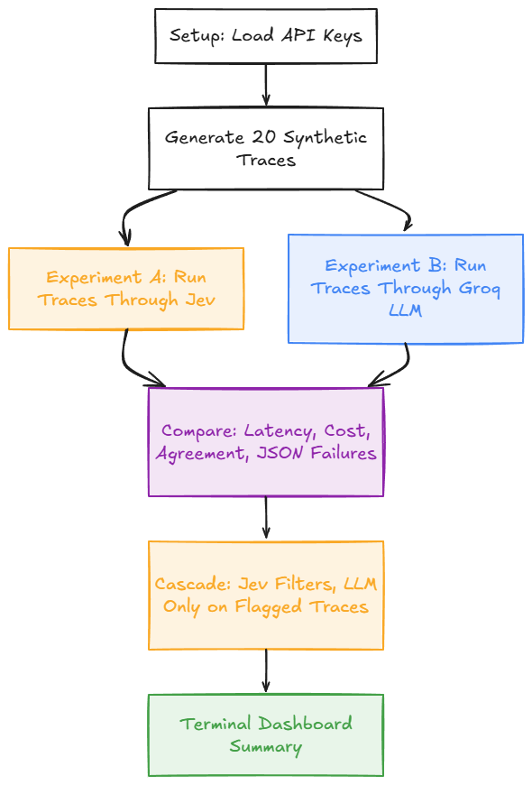

# Agent Trace Triage — Jev vs. LLM

A small experiment comparing **Jev** (TypeSafe AI's "System One" decision model) against a general-purpose LLM on the same task: triaging AI agent execution traces to figure out which ones actually need a human's attention.

Instead of running every trace through an expensive reasoning model, this uses a **fast, cheap decision layer (Jev) as a filter**, and only escalates the flagged subset to a slower LLM for deep root-cause analysis.

### Pipeline




### Notebook Flow




> The Mermaid blocks above render natively on GitHub — no image needed there. The `![...]` PNG placeholders above them are for platforms that don't render Mermaid (e.g. a blog post, a PDF export, or npm's package README viewer). Export each diagram as a PNG (e.g. via the [Mermaid Live Editor](https://mermaid.live)) and save it to the path shown, or delete the placeholder lines if you don't need them.

## What's Inside

- 20 synthetic agent execution traces (support, research, and billing agents) standing in for real observability data
- A Jev client wired up through **OpenRouter**'s System One endpoint, with a full mock fallback — the entire pipeline runs end-to-end with **zero API keys required**
- The same traces run through **Groq** (Qwen3.8 27B) as a comparison LLM, so you get real latency, cost, and agreement numbers instead of trusting a vendor's benchmark slide
- A working **Jev → LLM cascade**: every trace passes through Jev first, and only flagged traces get escalated
- A tiny terminal-style dashboard summarizing results

## Requirements

- Python 3.10+
- A Google Colab environment (recommended) or local Jupyter
- Optional, for real API calls instead of mock mode:
  - `OPENROUTER_API_KEY` — from [openrouter.ai/settings/keys](https://openrouter.ai/settings/keys)
  - `GROQ_API_KEY` — from [console.groq.com/keys](https://console.groq.com/keys)

## Quick Start

1. Open `Agent_Trace_Triage_Jev_vs_LLM.ipynb` in Google Colab (or Jupyter).
2. Run all cells. With no keys set, the notebook automatically runs in **mock mode** — you'll see the full pipeline (traces → decisions → comparison → cascade → dashboard) working end-to-end with no setup.
3. To run against real APIs:
   - Add `OPENROUTER_API_KEY` and `GROQ_API_KEY` as **Colab Secrets** (🔑 icon in the left sidebar), or export them as environment variables if running locally. Never hardcode keys into the notebook.
   - Re-run the setup cell — it will report `USE_MOCK_JEV = False` and `USE_MOCK_LLM = False` once both keys are detected.
   - The first real Jev call prints the raw response JSON so you can confirm the response parser matches what OpenRouter actually returns.

## ⚠️ Before Running With Real Keys

**Check that Jev is actually live on OpenRouter first:** [openrouter.ai/typesafe/jev-1.13](https://openrouter.ai/typesafe/jev-1.13). At the time this was built, OpenRouter's own listing was inconsistent — some pages showed it live with pricing, others said "coming soon." If the model isn't available when you try it, the client raises a clear error rather than failing silently, and the notebook's mock mode remains a safe fallback.

Jev itself is an early-access product (TypeSafe AI). This project uses OpenRouter as an access route specifically because it doesn't require TypeSafe's own waitlist key — but that also means availability and response shape aren't fully guaranteed to match TypeSafe's direct API.

## Repo Structure

```
agent-trace-triage/
├── README.md
├── Agent_Trace_Triage_Jev_vs_LLM.ipynb
├── traces.json                      # generated by the notebook; committed for reference
├── docs/
│   └── images/
│       ├── pipeline-diagram.png     # PNG export of the pipeline Mermaid diagram
│       └── notebook-flow.png        # PNG export of the notebook-flow Mermaid diagram
├── LICENSE
└── .gitignore
```

Notes:
- `docs/images/` only needs to exist if you're exporting the Mermaid diagrams as PNGs for use outside GitHub (e.g. embedding in a blog post). If you're fine relying on GitHub's native Mermaid rendering, you can skip this folder and remove the `![...]` placeholder lines from the README.
- `traces.json` is generated fresh each time the notebook runs (see the "Synthetic traces" cell), but committing a static copy makes the dataset reviewable without opening the notebook.
- Add a `requirements.txt` or `pyproject.toml` if you later split the notebook's logic into reusable Python modules instead of keeping it all inline.

## Notebook Structure

| Section | What it does |
|---|---|
| Setup | Installs dependencies, loads API keys securely |
| Jev client | OpenRouter-backed client + mock fallback, sharing one interface |
| Synthetic traces | 20 fake agent traces (`traces.json`) |
| Experiment A | Runs all traces through Jev (`Noul`, `Choice`, `Score` questions) |
| Experiment B | Runs the same traces through Groq for comparison |
| Comparison | Latency, cost, agreement, and JSON-parse-failure metrics side by side |
| Cascade | Jev filters every trace; only flagged ones go to the LLM |
| Dashboard | Terminal-style summary view |

## Why This Exists

TypeSafe's own materials are upfront that their headline performance and cost numbers are vendor-run, not independently verified. The point of this notebook isn't to take those numbers on faith — it's to give you a template for running the same comparison **on your own data**, with your own ground truth, so you can decide for yourself whether a fast decision-model layer is worth adding in front of your LLM calls.

## Limitations

- Traces are synthetic; real accuracy numbers require labeling real agent traces by hand as ground truth.
- Groq/OpenRouter pricing and model availability change frequently — verify current rates and listings before drawing conclusions from the cost comparison.
- Jev provides no natural-language rationale for its decisions — not a fit for use cases requiring an audit trail or explanation.

## License

MIT (or update to match your preference).
